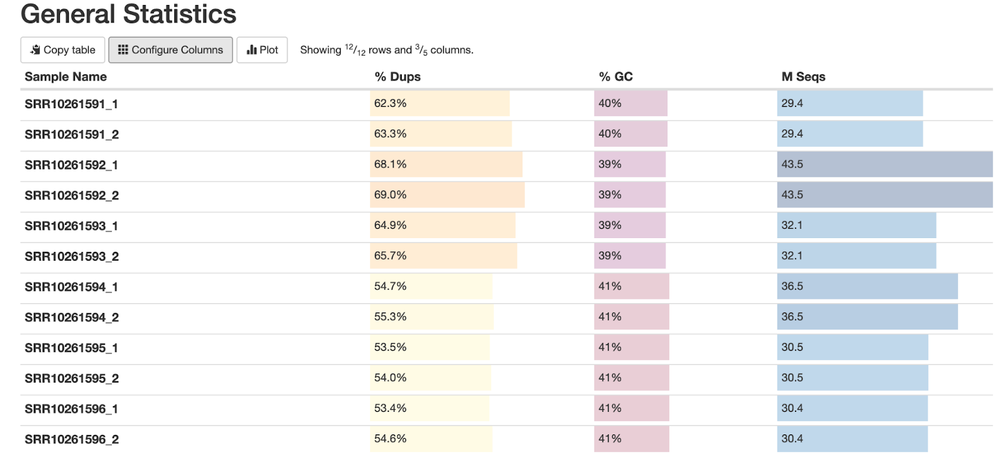
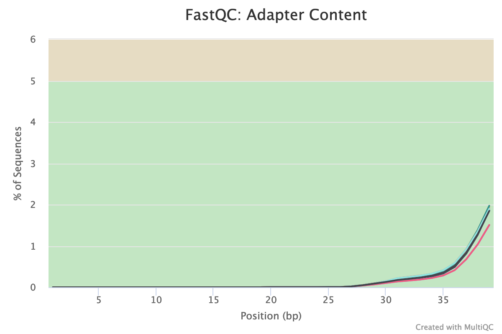
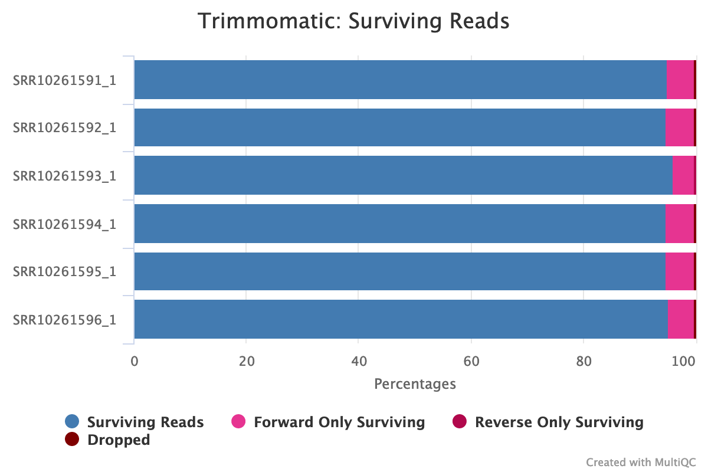

# ATAC-Seq Analysis: Yeast Hybridization Study

This repository documents a full end-to-end ATAC-seq analysis performed on yeast (**Saccharomyces cerevisiae** and its hybrid with **S. uvarum**). The analysis includes data download, preprocessing, alignment, peak calling, differential accessibility analysis, and visualization — all done using bash, R, and open-source bioinformatics tools.

---
## Objectives

This project was designed as a learning workflow with real biological data, aiming to:

- Understand chromatin accessibility changes in a yeast hybridization model
- Practice reproducible ATAC-seq data processing
- Explore downstream analysis with `DiffBind` and `MACS2`

---

## Experimental Design

- Dataset: SRA Project **PRJNA576599**
- 3 replicates of parental *S. cerevisiae*
- 3 replicates of hybrid *S. cerevisiae x S. uvarum*
- Sequencing: Illumina HiSeq 2500, paired-end 50 bp reads
- Reads/sample: ~60 million (high coverage)

---

## Directory Structure

```bash
raw_data/               # Raw FASTQ files
raw_data/trimming/      # Trimmed reads
ref_gen/                # Reference genomes + annotations
mapping/                # BAM files, stats
fastqc_initial/         # Raw read QC
fastqc_trimming/        # Trimmed read QC
diffbind/               # R-based peak comparison and visualization
```

## Setup: Computing environment
Using Conda for reproducibility. Create environments:
```bash
  # Core ATAC-seq environment
conda create -n atacseq
conda activate atacseq

conda install -c bioconda macs2 fastqc multiqc bwa samtools bedtools picard igv

# DiffBind environment
conda create -n diffbind
conda activate diffbind
conda install -c bioconda bioconductor-diffbind
```
### 1. Data Retrieval
Raw ATAC-seq data for this project was downloaded from the SRA using [SRA Explorer](https://sra-explorer.info/) with the project ID `PRJNA576599`.
To download the data, use the following script (modified from SRA Explorer):

```bash
bash raw_data/renamed_sra_explorer.sh
```
This will retrieve all six paired-end FASTQ files and place them in the raw_data/ directory.
Once downloaded, generate a sample list with:
```bash
  ls SRR*gz | cut -f 1 -d "_" | sort | uniq > sample_ids.txt
```
This list will be used for looping through all samples in later steps (trimming, mapping, etc.).

### 2. Quality Control
Before proceeding with alignment and peak calling, we performed quality control to assess the integrity of the raw FASTQ files. This step ensures that only high-quality sequencing data is carried forward.

### Tools Used

- `FastQC` v0.11.9: evaluates per-base quality, GC content, duplication rates, and adapter contamination
- `MultiQC` v1.12: aggregates individual FastQC reports into a single summary report

First, create a directory to store FastQC output:

```bash
mkdir fastqc_initial
```
Then run FastQC on all downloaded raw reads
```bash
fastqc -t 2 *.fastq.gz -o fastqc_initial
```
Each FASTQ file will produce an `.html` and `.zip` output in the `fastqc_initial/` directory.

To aggregate all FastQC results, run MultiQC:
```bash
  cd fastqc_initial
multiqc .
```

- The **number of sequencing reads** per sample is consistent, with each having approximately 30 million reads in each direction (paired-end).
- **Duplication percentages** are relatively high, which is expected in ATAC-seq datasets due to the enrichment of short, open chromatin regions. These duplication artifacts are mostly PCR-derived and will be removed in a later step.
- **GC content** is around 39–40%, which is within the expected range for *S. cerevisiae* and *S. uvarum*. This indicates that the dataset is not contaminated and base composition is consistent across samples.


- Adapter contamination begins roughly midway through the reads, which is typical for transposase-based protocols like ATAC-seq.
- Although the adapter signal is low, it is consistently present across all samples.
- These adapters must be trimmed to avoid misleading read alignments and false peak detection in downstream analyses.

Trimming will be performed in the next step to remove these sequences and improve overall read quality.

## Trimming
We used Trimmomatic (v0.39) to trim adapters and low-quality bases from the raw paired-end FASTQ files.
Use this loop to generate trimming commands for each sample listed in `sample_ids.txt`:
```bash
while read sample_id; do
  echo trimmomatic PE -threads 2 \
    ../${sample_id}_1.fastq.gz ../${sample_id}_2.fastq.gz \
    ${sample_id}_tr_1P.fastq.gz ${sample_id}_tr_1U.fastq.gz \
    ${sample_id}_tr_2P.fastq.gz ${sample_id}_tr_2U.fastq.gz \
    ILLUMINACLIP:~/miniconda2/envs/atacseq/share/trimmomatic-0.39-2/adapters/NexteraPE-PE.fa:2:30:10 \
    MINLEN:30
done < ../sample_ids.txt > trimming_commands.txt
```
Now execute the command
```bash
bash trimming_commands.txt 1>trimming_output 2>trimming_error
```
This executes all trimming commands and logs output and errors to separate files.

### Check trimming quality
Run FastQC and MultiQC on the trimmed paired reads:
```bash
mkdir fastqc_trimming
fastqc -t 2 *P.fastq.gz -o fastqc_trimming/
multiqc .
```

- Only a small fraction of reads were removed — most were retained as high-quality paired reads.
- Adapter contamination was fully eliminated.
- Read length and base quality distributions improved across the board.


