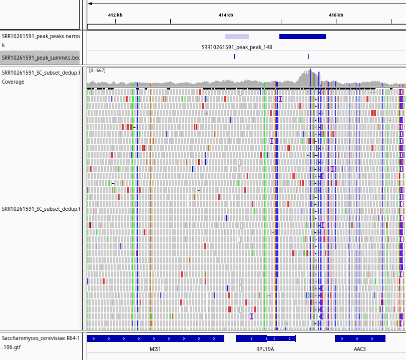

# ATAC-Seq Analysis: Yeast Hybridization Study

This repository documents a full end-to-end ATAC-seq analysis performed on yeast (**Saccharomyces cerevisiae** and its hybrid with **S. uvarum**). The analysis includes data download, preprocessing, alignment, peak calling, and visualization — all done using bash, R, and open-source bioinformatics tools.

---
## Objectives

This project was designed as a learning workflow with real biological data, aiming to:

- Understand chromatin accessibility changes in a yeast hybridization model
- Practice reproducible ATAC-seq data processing
- Explore downstream analysis with `DiffBind` and `MACS2`

---

## Experimental Design

- Dataset: SRA Project **PRJNA576599**
- 3 replicates of parental *S. cerevisiae*
- 3 replicates of hybrid *S. cerevisiae x S. uvarum*
- Sequencing: Illumina HiSeq 2500, paired-end 50 bp reads
- Reads/sample: ~60 million (high coverage)

---


## Setup: Computing environment
Using Conda for reproducibility. Create environments:
```bash
  # Core ATAC-seq environment
conda create -n atacseq
conda activate atacseq

conda install -c bioconda macs2 fastqc multiqc bwa samtools bedtools picard igv

# DiffBind environment
conda create -n diffbind
conda activate diffbind
conda install -c bioconda bioconductor-diffbind
```
### 1. Data Retrieval
Raw ATAC-seq data for this project was downloaded from the SRA using [SRA Explorer](https://sra-explorer.info/) with the project ID `PRJNA576599`.
To download the data, use the following script (modified from SRA Explorer):

```bash
bash raw_data/renamed_sra_explorer.sh
```
This will retrieve all six paired-end FASTQ files and place them in the raw_data/ directory.
Once downloaded, generate a sample list with:
```bash
  ls SRR*gz | cut -f 1 -d "_" | sort | uniq > sample_ids.txt
```
This list will be used for looping through all samples in later steps (trimming, mapping, etc.).

### 2. Quality Control
Before proceeding with alignment and peak calling, we performed quality control to assess the integrity of the raw FASTQ files. This step ensures that only high-quality sequencing data is carried forward.

### Tools Used

- `FastQC` v0.11.9: evaluates per-base quality, GC content, duplication rates, and adapter contamination
- `MultiQC` v1.12: aggregates individual FastQC reports into a single summary report

First, create a directory to store FastQC output:

```bash
mkdir fastqc_initial
```
Then run FastQC on all downloaded raw reads
```bash
fastqc -t 2 *.fastq.gz -o fastqc_initial
```
Each FASTQ file will produce an `.html` and `.zip` output in the `fastqc_initial/` directory.

To aggregate all FastQC results, run MultiQC:
```bash
  cd fastqc_initial
multiqc .
```

- The **number of sequencing reads** per sample is consistent, with each having approximately 30 million reads in each direction (paired-end).
- **Duplication percentages** are relatively high, which is expected in ATAC-seq datasets due to the enrichment of short, open chromatin regions. These duplication artifacts are mostly PCR-derived and will be removed in a later step.
- **GC content** is around 39–40%, which is within the expected range for *S. cerevisiae* and *S. uvarum*. This indicates that the dataset is not contaminated and base composition is consistent across samples.


- Adapter contamination begins roughly midway through the reads, which is typical for transposase-based protocols like ATAC-seq.
- Although the adapter signal is low, it is consistently present across all samples.
- These adapters must be trimmed to avoid misleading read alignments and false peak detection in downstream analyses.

Trimming will be performed in the next step to remove these sequences and improve overall read quality.

## Trimming
We used Trimmomatic (v0.39) to trim adapters and low-quality bases from the raw paired-end FASTQ files.
Use this loop to generate trimming commands for each sample listed in `sample_ids.txt`:
```bash
while read sample_id; do
  echo trimmomatic PE -threads 2 \
    ../${sample_id}_1.fastq.gz ../${sample_id}_2.fastq.gz \
    ${sample_id}_tr_1P.fastq.gz ${sample_id}_tr_1U.fastq.gz \
    ${sample_id}_tr_2P.fastq.gz ${sample_id}_tr_2U.fastq.gz \
    ILLUMINACLIP:~/miniconda2/envs/atacseq/share/trimmomatic-0.39-2/adapters/NexteraPE-PE.fa:2:30:10 \
    MINLEN:30
done < ../sample_ids.txt > trimming_commands.txt
```
Now execute the command
```bash
bash trimming_commands.txt 1>trimming_output 2>trimming_error
```
This executes all trimming commands and logs output and errors to separate files.

### Check trimming quality
Run FastQC and MultiQC on the trimmed paired reads:
```bash
mkdir fastqc_trimming
fastqc -t 2 *P.fastq.gz -o fastqc_trimming/
multiqc .
```

- Only a small fraction of reads were removed — most were retained as high-quality paired reads.
- Adapter contamination was fully eliminated.
- Read length and base quality distributions improved across the board.

## Mapping & Related Analyses
This step covers reference genome preparation, read alignment, and post-processing steps such as deduplication and filtering.

---

### Reference Genome Setup

We used reference genomes for *S. cerevisiae* and *S. uvarum*, and constructed a hybrid reference genome by concatenating the two. To mask ribosomal regions in *S. cerevisiae*, the following was done:

```bash
# Download S. cerevisiae genome and annotation
wget http://ftp.ensembl.org/pub/release-106/fasta/saccharomyces_cerevisiae/dna/Saccharomyces_cerevisiae.R64-1-1.dna.toplevel.fa.gz
wget http://ftp.ensembl.org/pub/release-106/gtf/saccharomyces_cerevisiae/Saccharomyces_cerevisiae.R64-1-1.106.gtf.gz
gunzip Saccharomyces_cerevisiae.R64-1-1.*

# Mask rRNA on chromosome XII
bedtools maskfasta -fi Saccharomyces_cerevisiae.R64-1-1.dna.toplevel.fa -bed mask_rRNA.bed -fo S_cerevisiae_masked_rRNA.fasta

# Get S. uvarum genome and combine into hybrid
wget http://www.saccharomycessensustricto.org/current/Sbay/Sbay.ultrascaf
wget http://www.saccharomycessensustricto.org/current/Sbay/Sbay.unplaced
cat Sbay.ultrascaf Sbay.unplaced > S_uvarum.fasta
cat S_cerevisiae_masked_rRNA.fasta S_uvarum.fasta > hybrid.fasta
```
### Indexing Genomes with BWA
bwa index -p SC S_cerevisiae_masked_rRNA.fasta
bwa index -p hybrid hybrid.fasta

### Read Mapping
Each sample was mapped to either the S. cerevisiae or hybrid genome using BWA MEM. Output BAM files were sorted and indexed with SAMtools. A Bash script was used:
bash map_sort_index_stat.sh > map_sort_index_stat_commands.txt
bash map_sort_index_stat_commands.txt
The script determined which genome to use per sample:
```bash
while read sample; do
  if [ "$sample" == SRR10261591 ] || [ "$sample" == SRR10261592 ] || [ "$sample" == SRR10261593 ]; then
    ref_gen=SC
  else
    ref_gen=hybrid
  fi

  echo "bwa mem -t 2 ./ref_gen/${ref_gen} ../raw_data/trimming/${sample}_tr_1P.fastq.gz ../raw_data/trimming/${sample}_tr_2P.fastq.gz | samtools sort -@2 -o ${sample}.bam -" \
       "&& samtools index ${sample}.bam" \
       "&& samtools flagstat ${sample}.bam > ${sample}_map_stats.txt"
done < ../raw_data/sample_ids.txt
```
### Post-mapping Processing
After mapping, the BAM files were filtered to:

-Keep only S. cerevisiae chromosomes
-Remove mitochondrial reads
-Mark PCR duplicates using Picard
The script used:
```bash
while read sample; do
  echo "samtools view -bh ${sample}.bam I II III IV V VI VII VIII IX X XI XII XIII XIV XV XVI > ${sample}_SC_subset.bam" \
       "&& picard MarkDuplicates I=${sample}_SC_subset.bam O=${sample}_SC_subset_dedup.bam M=${sample}_markdup_metrics.txt" \
       "&& samtools index ${sample}_SC_subset_dedup.bam" \
       "&& samtools flagstat ${sample}_SC_subset_dedup.bam > ${sample}_SC_subset_dedup_map_stats.txt"
done < ../raw_data/sample_ids.txt
```
## Peak Calling
With the deduplicated BAM files prepared, we performed ATAC-seq peak calling using **MACS2** (v2.2.7.1). MACS2 identifies genomic regions that are significantly enriched with reads — in this case, regions of open chromatin accessible to the Tn5 transposase.
---

### MACS2 Script

We generated per-sample peak calling commands using the following script:

```bash
while read sample; do
  echo "macs2 callpeak -t ${sample}_SC_subset_dedup.bam -f BAMPE -n ${sample}_peak -g 12000000 --keep-dup all"
done < ../raw_data/sample_ids.txt > call_peaks_commands.txt
```
Then executed: ```bash call_peaks_commands.txt```

## Peak Visualisation
To visualize the results of the ATAC-seq analysis — including alignments and called peaks — we used **Integrative Genomics Viewer (IGV)** v2.4.9. This step allows visual confirmation of successful peak calling and inspection of chromatin accessibility patterns across the genome.
### Files visualized:

- Deduplicated BAM file: `SRR10261591_SC_subset_dedup.bam`
- Reference genome: `S_cerevisiae_masked_rRNA.fasta`
- Gene annotation (GTF): `Saccharomyces_cerevisiae.R64-1-1.106.gtf`
- MACS2 peaks: `SRR10261591_peak_peaks.narrowPeak`
- Peak summits: `SRR10261591_peak_summits.bed`

Launch IGV by typing igv in your terminal.
In IGV, we first loaded the reference genome from the file `S_cerevisiae_masked_rRNA.fasta` using the menu option `Genome > Load Genome from File`. Next, we loaded the gene annotation file `Saccharomyces_cerevisiae.R64-1-1.106.gtf` via `File > Load from File`. After loading the reference and annotation, we added the deduplicated alignment file `SRR10261591_SC_subset_dedup.bam`. Finally, we loaded the MACS2 output files `SRR10261591_peak_peaks.narrowPeak` and `SRR10261591_peak_summits.bed` as separate tracks. These files were rendered together in IGV, allowing simultaneous visualization of coverage, aligned reads, annotated genes, peak regions, and summit positions. This integrated view provided a useful confirmation that the called peaks aligned with biologically plausible, accessible genomic regions.


In the visualization, one clear example includes an intergenic peak (visible in dark blue) whose summit aligns precisely with a region of elevated coverage in the BAM file. This peak is situated between the genes AAC3 and RPL19A and likely corresponds to a regulatory element such as a transcription factor binding site or promoter region. IGV enables this type of integrated analysis by allowing simultaneous viewing of aligned reads, coverage profiles, gene annotations, and peak calls. It supports a variety of input formats, including BAM, BED, GTF, and reference FASTA files, and is well-suited for exploring ATAC-seq data in detail.


